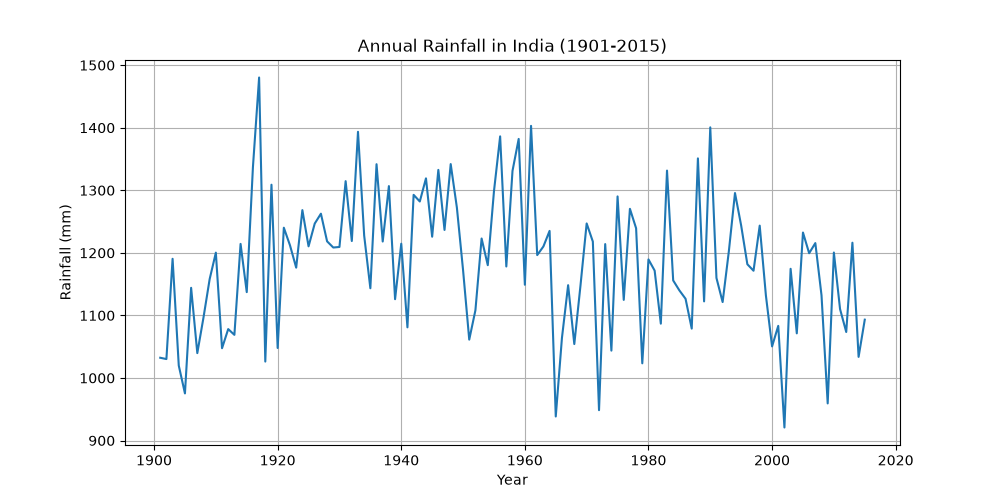
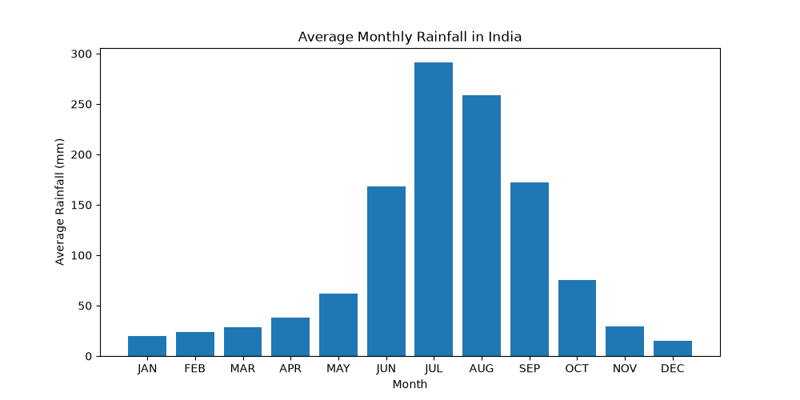
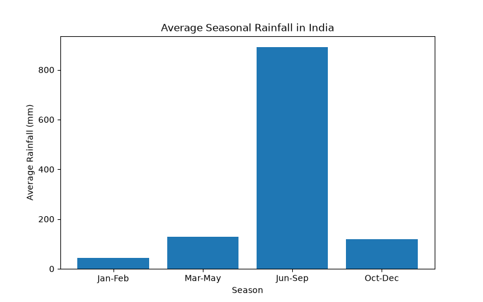
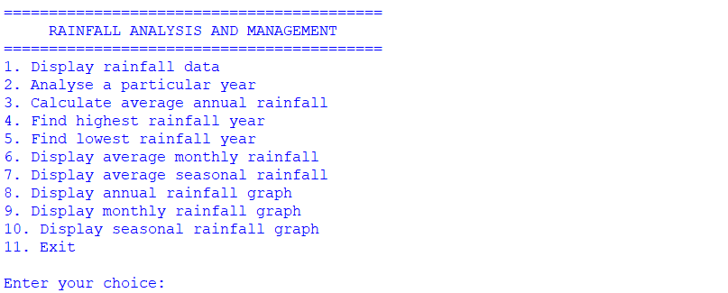
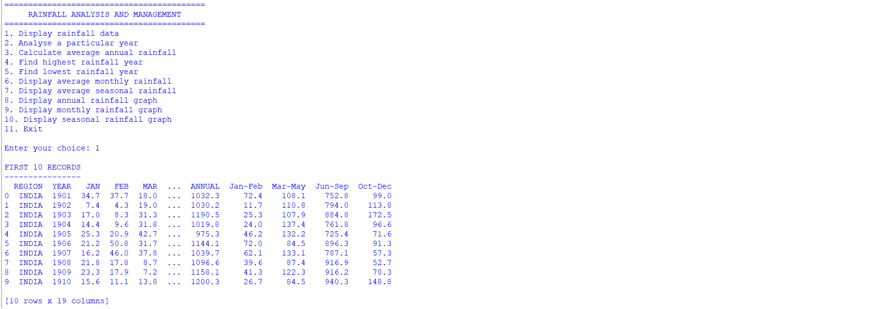
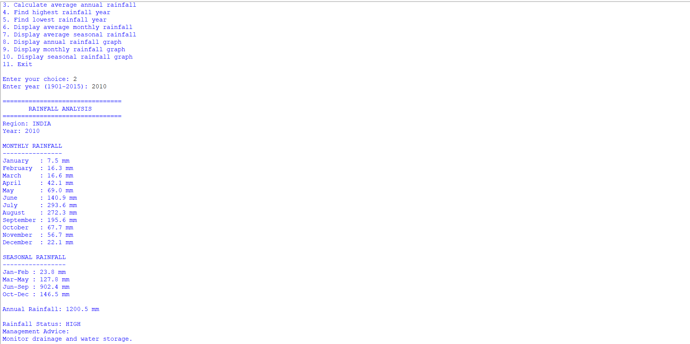
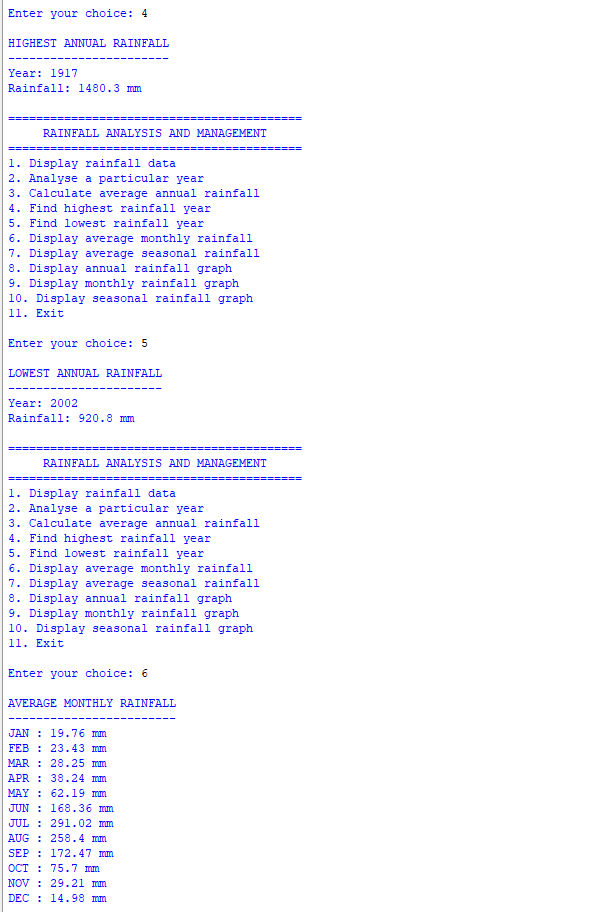

# rainfall-analysis-management-system-India

A Python-based data analysis project for studying historical rainfall patterns across India from 1901 to 2015.
The project uses Python, Pandas, and Matplotlib to process historical rainfall data, calculate statistical insights, analyse monthly and seasonal patterns, and generate visualizations.

## Overview
Rainfall is an important natural resource that affects agriculture, water availability, reservoirs, and the environment.
This project analyses historical rainfall data for India from 1901 to 2015. The data is stored in CSV format and processed using Pandas.
The application provides a menu-driven interface that allows users to:
* View rainfall records
* Analyse rainfall for a specific year
* Calculate average annual rainfall
* Find the year with the highest annual rainfall
* Find the year with the lowest annual rainfall
* Analyse average monthly rainfall
* Analyse average seasonal rainfall
* Classify annual rainfall
* Generate rainfall visualizations
The project demonstrates how a real-world dataset can be processed and transformed into useful information using Python.

## Features
### Data Handling
* Reads historical rainfall data from a CSV file
* Processes the dataset using Pandas
* Displays the first ten records

### Year-wise Analysis
Users can select a year between 1901 and 2015 to view:
* Monthly rainfall
* Seasonal rainfall
* Annual rainfall
* Rainfall classification
* Basic management advice

### Annual Statistics
The program calculates:
* Average annual rainfall
* Highest annual rainfall
* Lowest annual rainfall

### Monthly Analysis
Calculates the historical average rainfall for each month from January to December.

### Seasonal Analysis
Calculates average rainfall for four seasonal periods:
* January to February
* March to May
* June to September
* October to December

### Rainfall Classification
The project classifies annual rainfall into three categories:
* LOW
* NORMAL
* HIGH
These thresholds are simplified rules created specifically for this educational project and are not official meteorological classifications.

### Data Visualization
The project uses Matplotlib to generate:
* Annual rainfall line graphs
* Average monthly rainfall bar graphs
* Average seasonal rainfall bar graphs

## Technology Stack
| Technology | Purpose                      |
| ---------- | ---------------------------- |
| Python 3   | Programming language         |
| Pandas     | Data processing and analysis |
| Matplotlib | Data visualization           |
| CSV        | Data storage                 |

## Dataset
The project uses the **All India Area Weighted Monthly, Seasonal and Annual Rainfall (mm), 1901-2015** dataset.
The dataset contains:
* Region
* Year
* Monthly rainfall
* Seasonal rainfall
* Annual rainfall

### Source
Government of India's Open Government Data Platform:
[Data.gov.in](https://data.gov.in/)
The original dataset should be used according to the terms and attribution requirements of its source.

## Dataset Structure
| Column  | Description                           |
| ------- | ------------------------------------- |
| REGION  | Region for which rainfall is recorded |
| YEAR    | Year of observation                   |
| JAN     | January rainfall                      |
| FEB     | February rainfall                     |
| MAR     | March rainfall                        |
| APR     | April rainfall                        |
| MAY     | May rainfall                          |
| JUN     | June rainfall                         |
| JUL     | July rainfall                         |
| AUG     | August rainfall                       |
| SEP     | September rainfall                    |
| OCT     | October rainfall                      |
| NOV     | November rainfall                     |
| DEC     | December rainfall                     |
| ANNUAL  | Annual rainfall                       |
| Jan-Feb | January-February rainfall             |
| Mar-May | March-May rainfall                    |
| Jun-Sep | June-September rainfall               |
| Oct-Dec | October-December rainfall             |

## Project Structure
```text
rainfall-analysis-management-system/
├── README.md
├── LICENSE
├── requirements.txt
├── .gitignore
│
├── src/
│   └── rainfall_analysis.py
│
├── data/
│   └── rainfall.csv
│
├── outputs/
│   ├── annual_rainfall.png
│   ├── monthly_rainfall.png
│   └── seasonal_rainfall.png
│
├── screenshots/
│   ├── main-menu.png
│   ├── data-display.png
│   ├── year-analysis.png
│   ├── classification.png
│   └── statistics.png
│
└── docs/
    └── project-report.pdf
```

## Installation
### 1. Clone the repository
```bash
git clone https://github.com/YOUR-USERNAME/rainfall-analysis-management-system.git
```

### 2. Navigate to the project directory
```bash
cd rainfall-analysis-management-system
```

### 3. Install the required libraries
```bash
pip install -r requirements.txt
```

## Running the Project
Run the following command:
```bash
python src/rainfall_analysis.py
```

The program will display the main menu:
```text
==========================================
     RAINFALL ANALYSIS AND MANAGEMENT
==========================================

1. Display rainfall data
2. Analyse a particular year
3. Calculate average annual rainfall
4. Find highest rainfall year
5. Find lowest rainfall year
6. Display average monthly rainfall
7. Display average seasonal rainfall
8. Display annual rainfall graph
9. Display monthly rainfall graph
10. Display seasonal rainfall graph
11. Exit
```
Enter the corresponding number to perform an operation.

## Example
Selecting option `2` allows the user to analyse a specific year.

```text
Enter year (1901-2015): 2010
```
The program displays the monthly, seasonal, and annual rainfall for the selected year.
It also applies the project's rainfall classification rules and displays a basic management suggestion.

## Visualizations
### Annual Rainfall
The annual rainfall graph shows the variation in India's area-weighted annual rainfall between 1901 and 2015.


### Average Monthly Rainfall
The monthly rainfall graph compares the historical average rainfall for each month.


### Average Seasonal Rainfall
The seasonal rainfall graph compares the historical average rainfall across the four seasonal periods.


## Screenshots
### Main Menu


### Rainfall Data


### Year-wise Analysis


### Rainfall Classification


### Statistical Analysis


## Limitations
The current version has several limitations:
1. The dataset contains rainfall information only up to 2015.
2. The project represents India as a whole rather than individual cities, districts, or states.
3. The system does not use real-time weather information.
4. The system does not provide scientifically validated rainfall forecasting.
5. The LOW, NORMAL, and HIGH categories are simplified rules created for this project.
6. The program depends on the CSV file being present and containing the expected columns.
7. The management suggestions are general recommendations and do not consider factors such as soil conditions, drainage capacity, reservoir levels, or river levels.

## Future Scope
The project can be extended in several ways:
* Add rainfall data from years after 2015
* Include state-wise rainfall analysis
* Include district-wise rainfall analysis
* Connect the system to real-time weather APIs
* Add rainfall forecasting using machine learning
* Develop flood and drought analysis
* Add a graphical user interface
* Build an interactive web-based rainfall dashboard
* Add geographical rainfall maps
* Allow users to filter and compare different time periods

## Learning Outcomes
This project provided practical experience with:
* Python functions
* Conditional statements
* Loops
* User input
* Pandas DataFrames
* CSV data handling
* Statistical calculations
* Data filtering
* Data visualization
* Matplotlib
* Real-world datasets
* Menu-driven programming
The project demonstrates how raw data can be processed, analysed, and converted into meaningful statistical information and visualizations.

## Author
**Dhrupad Pant**
Python | Data Analysis | Data Visualization
